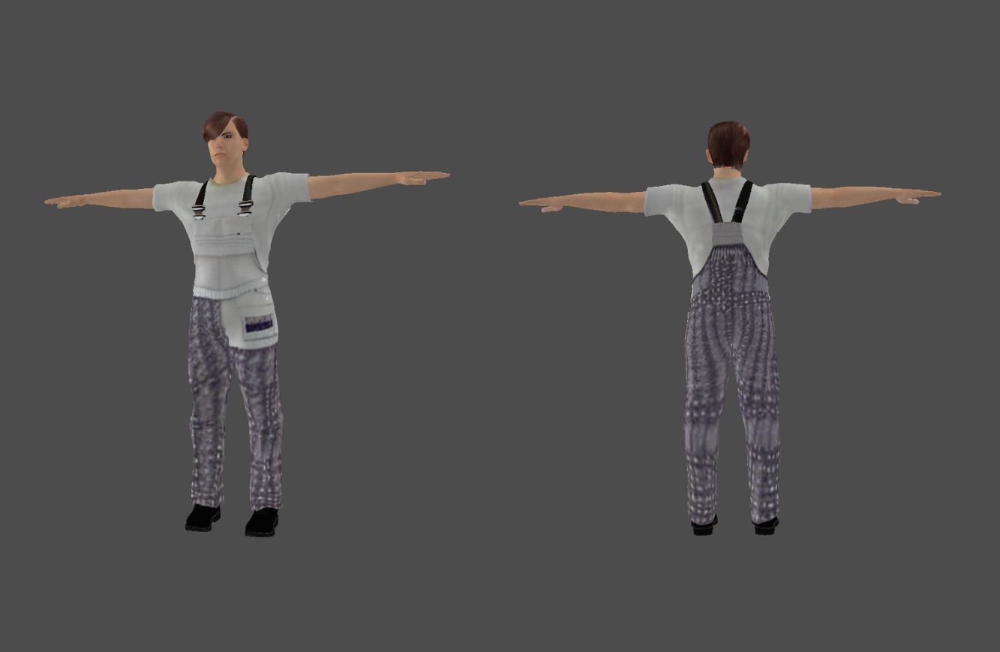
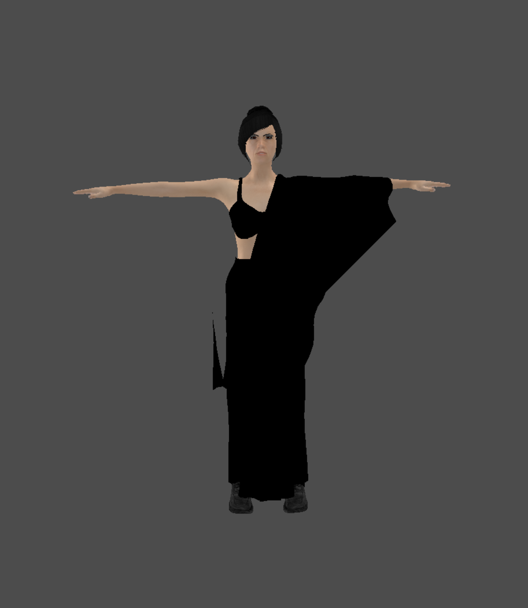
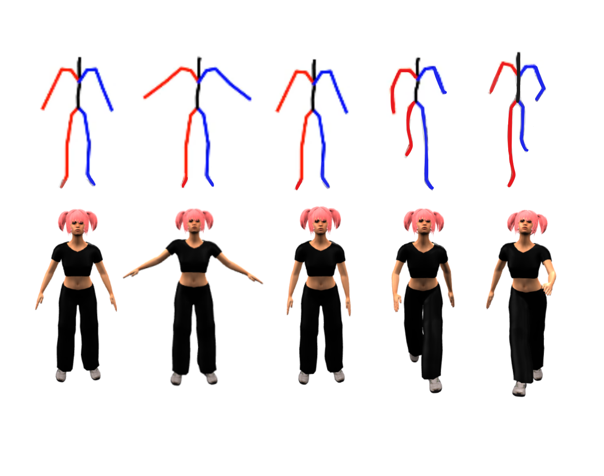

# HUGMAN

**H**umanoid **U**nderstanding and **G**eneration via **M**ultimodal **A**I and **N**LP

A multimodal AI-driven framework that automates humanoid character generation and animation from natural language descriptions. By combining parametric modeling, curated asset retrieval, and generative texture synthesis, the system achieves a balance between reliability, interpretability, and scalability, producing animation-ready humanoids in under two minutes.

## Overview

HUGMAN transforms text descriptions into fully animated 3D human characters through an integrated pipeline that leverages:

- **Parametric Modeling**: Precise character generation using parametric system
- **AI-Powered Asset Retrieval**: Intelligent clothing and accessory selection
- **Generative Texture Synthesis**: High-quality texture generation via Stable Diffusion
- **Motion Generation**: Seamless animation creation using MoMask text-to-motion
- **Real-time Processing**: Complete pipeline execution in under 2 minutes

The integration of MoMask further extends the pipeline to motion generation, validating its applicability for interactive and real-time contexts.

## Examples

### Character Generation Examples

**Prompt 1**: "Create a man wearing working attire with purple patterned texture"


**Prompt 2**: "An Indian woman wearing black saree"


### Animation and Retargeting Pipeline

Retargeted character animation obtained by mapping BVH motion data onto the character rig for **prompt: A cool teen-age girl walking slowly**



## System Requirements

- **OS**: Windows 11
- **GPU**: NVIDIA GeForce RTX 4060 (or compatible CUDA-capable GPU)
- **RAM**: 8GB minimum, 16GB recommended

## Prerequisites

- **Blender 2.82** (tested version)
- **Python 3.9** (for main environment)
- **Python 3.7** (for MoMask environment - as tested in [MoMask repository](https://github.com/EricGuo5513/momask-codes))
- **Ollama** with llama3.2 model
- **CUDA Toolkit** (for GPU acceleration)

## Setup

### 1. Clone and Setup Virtual Environment
```bash
git clone https://github.com/musfirakhan/HUGMAN.git
cd HUGMAN
python -m venv venv-39
venv-39\Scripts\activate  # Windows
pip install -r requirements.txt
```

### 2. Setup MoMask Environment
```bash
cd animations/momask-codes-main
conda env create -f environment.yml
conda activate momask
pip install -r requirements.txt
```

### 3. Download MoMask Pre-trained Models
Download the required model files from [Google Drive](https://drive.google.com/drive/folders/1sHajltuE2xgHh91H9pFpMAYAkHaX9o57):

- **humanml3d_models.zip** (179.4 MB) - HumanML3D dataset models
- **humanml3d_evaluator.zip** (216.4 MB) - Evaluation models

Extract the downloaded files to `animations/momask-codes-main/checkpoints/` directory:

```
animations/momask-codes-main/checkpoints/
├── t2m/                           # HumanML3D models
│   ├── rvq_nq6_dc512_nc512_noshare_qdp0.2/
│   ├── t2m_nlayer8_nhead6_ld384_ff1024_cdp0.1_rvq6ns/
│   ├── tres_nlayer8_ld384_ff1024_rvq6ns_cdp0.2_sw/
│   └── length_estimator/
└── kit/                           # KIT-ML models (optional)
    ├── rvq_nq6_dc512_nc512_noshare_qdp0.2_k/
    ├── t2m_nlayer8_nhead6_ld384_ff1024_cdp0.1_rvq6ns_k/
    └── tres_nlayer8_ld384_ff1024_rvq6ns_cdp0.2_sw_k/
```

### 4. Download Fashion Model
Download the custom fashion model from [Google Drive](https://drive.google.com/drive/folders/1sGXVH4_JMqpBZQ2geQvTKUyd_ZTDrJ_5?usp=drive_link):

- **model.safetensors** (474.7 MB) - Main model weights
- **tokenizer.json** (3.4 MB) - Tokenizer configuration
- **config.json** (880 bytes) - Model configuration
- **generation_config.json** (119 bytes) - Generation settings
- **vocab.json** (779 KB) - Vocabulary file
- **merges.txt** (446 KB) - BPE merges
- **special_tokens_map.json** (131 bytes) - Special tokens
- **tokenizer_config.json** (507 bytes) - Tokenizer settings

Extract all files to the `fashionmodel_path/` directory in the project root:

```
HUGMAN/
├── fashionmodel_path/              # Fashion model files
│   ├── model.safetensors
│   ├── tokenizer.json
│   ├── config.json
│   ├── generation_config.json
│   ├── vocab.json
│   ├── merges.txt
│   ├── special_tokens_map.json
│   └── tokenizer_config.json
└── ...
```

### 5. Install Ollama
- Download from [ollama.ai](https://ollama.ai)
- Install and pull llama3.2 model:
```bash
ollama pull llama3.2
```

### 6. Install Rokoko Studio Plugin for Blender
For motion capture and animation retargeting, install the Rokoko Studio plugin for Blender:

1. Visit the official Rokoko Studio plugin installation guide: https://support.rokoko.com/hc/en-us/articles/4410463492241-Install-the-Blender-plugin
2. Follow the instructions to install the plugin in your Blender installation
3. The plugin enables seamless integration between Rokoko Studio and Blender for motion capture workflows

### 7. Configure Blender Path
Update the Blender path in `hugman.py`:
```python
run_blender(r"C:\Program Files\Blender Foundation\Blender 2.82\blender.exe", action_prompt)
```

## Usage

### Clean Previous Outputs (Recommended)
Before running the pipeline, it's recommended to clean up previous outputs:
```bash
python clear.py
```

### Generate Character with Animation
```bash
python hugman.py "A teen age boy in yellow shirt and black pants waving"
```

### Generate Static Character Only
```bash
python hugman.py "A woman in a red dress"
```

## Output

- **3D Models**: Saved in `output/` directory (`.dae`, `.fbx`, `.obj` formats)
- **Animations**: Saved in `animations/` directory (`.glb` formats)

## File Structure

```
HUGMAN/
├── hugman.py                      # Main pipeline runner
├── parameter_generator.py         # Character parameter generation and saves in character.json
├── makehuman.py                   # MakeHuman application
├── fashionmodel_path/             # Custom fashion model
├── animations/                    # Animation generation
│   ├── momask-codes-main/         # MoMask text-to-motion
│   │   ├── checkpoints/           # Pre-trained models
│   │   ├── gen_t2m.py            # Text-to-motion generation
│   │   └── requirements.txt       # MoMask dependencies
│   ├── text2animations.py         # Animation pipeline
│   └── blender_retargetting.py    # Blender integration
├── output/                        # Generated 3D models
├── generated_characters/          # Character data
└── venv-39/                      # Python virtual environment
```

## Credits

### MakeHuman
This project uses **MakeHuman** for 3D character generation.

**MakeHuman** is free software: you can redistribute it and/or modify it under the terms of the GNU Affero General Public License as published by the Free Software Foundation, either version 3 of the License, or (at your option) any later version.

- **Project Home Page**: http://www.makehumancommunity.org/
- **Code Home Page**: https://github.com/makehumancommunity/
- **License**: AGPL3
- **Copyright**: MakeHuman Team 2001-2020

### MoMask
Text-to-motion generation powered by [MoMask](https://github.com/EricGuo5513/momask-codes).

**MoMask** is the official implementation of "MoMask: Generative Masked Modeling of 3D Human Motions (CVPR2024)".

- **Repository**: https://github.com/EricGuo5513/momask-codes
- **License**: MIT
- **Pre-trained Models**: [Google Drive](https://drive.google.com/drive/folders/1sHajltuE2xgHh91H9pFpMAYAkHaX9o57)

### Ollama
LLM integration powered by Ollama with llama3.2 model.

### Hugging Face
This project uses **Hugging Face** libraries for AI model integration.

- **Repository**: https://github.com/huggingface/transformers

### Stable Diffusion
Texture generation powered by **Stable Diffusion** models through Hugging Face diffusers.

- **Repository**: https://github.com/CompVis/stable-diffusion

## Support

If you need any help with setup, usage, or encounter any issues, feel free to contact me:

- **Email**: musfiraaslam3@gmail.com

I'm happy to help with any questions or problems you might encounter while using HUGMAN!

